<div align="center">


<a href="https://git.io/typing-svg">
  
</a>

<br/>


[](https://kaivera.io)


<br/>
<br/>

[](https://www.linkedin.com/in/tankaihooi/)
[](mailto:joshuatan.kaihooi@gmail.com)
[](https://github.com/tankaihooi)

<br/>
<br/>


</div>

---

##  About Me

I'm **Tan Kai Hooi**, a penultimate-year **Data Science & Artificial Intelligence** student at **NTU Singapore**. I work on **agentic workflows and applied AI automation for real businesses rather than benchmarks**, and one lesson keeps coming back: **picking the right business process to automate often matters more than how you automate it.**

That's why I founded **[Kaivera](https://kaivera.io)**, an AI operations partner for businesses in Southeast Asia. We find where AI actually pays off in a company's operations, build it, and keep it running, from automating the manual document and approval work that quietly eats a team's time to custom AI tools and models where off-the-shelf won't do.

On the engineering side, I build **multi-agent systems on LangGraph that check their own work**: critic agents that test every claim against its source, text-to-SQL investigators on read-only connections, and human-in-the-loop graphs that pause before money moves and resume from Postgres. I measure them with planted-error evals and publish the traces. Right now I'm going deeper into **generative and agentic AI**.

<div align="center">

| Engineering Focus | What I Build |
| --- | --- |
| **Agentic AI** | LangGraph multi-agent pipelines, critic and auditor agents, human approval gates, state patching |
| **RAG & Text-to-SQL** | ChromaDB, Qdrant and pgvector retrieval, grounded citations, self-correcting SQL on read-only connections |
| **Business Automation** | Power Automate, Office Scripts, Copilot Studio agents, AI Builder, Dataverse and SharePoint grounding |
| **Applied ML & Forecasting** | Predictive site selection, SARIMA / Prophet / NeuralProphet, conformal intervals, CNNs with Grad-CAM |
| **Full-Stack AI Products** | FastAPI backends, React and Next.js frontends, Postgres, Streamlit apps on Hugging Face Spaces |

</div>

**Open To**

<div align="center">


<br/>
<br/>



</div>

---

## Tech Stack

<div align="center">

### Languages


<br/>
<br/>


### Frontend


### Backend & Databases


### Cloud, DevOps & Tooling


### AI & ML


### Business Automation


</div>

---

## AI / ML Expertise

| Domain | Proficiency | Details |
| --- | --- | --- |
| **Multi-Agent Systems** | Advanced | LangGraph planners, parallel scraper subgraphs, critic and auditor agents, bounded retry and gap loops |
| **Human-in-the-Loop & Agent Safety** | Advanced | Interrupt-before gates, state patching, exactly-once approvals, idempotent side effects, audit logs |
| **RAG** | Strong | ChromaDB, Qdrant and pgvector retrieval, numbered citations, verbatim-quote grounding checks |
| **Text-to-SQL** | Strong | LLM-generated SQL on read-only connections that retries on errors and empty results |
| **LLM Evaluation** | Strong | Planted-fabrication evals, labelled test sets, LLM-judge benchmarks with calibration caveats |
| **Observability** | Strong | Public LangSmith traces, per-agent timelines, cost and latency per run |
| **Business Process Automation** | Strong | Power Automate, Office Scripts, Copilot Studio, AI Builder, SAP Concur REST API |
| **Time-Series Forecasting** | Strong | SARIMA, Prophet, NeuralProphet, split conformal intervals, rolling backtests, Diebold-Mariano tests |
| **Deep Learning** | Developing | AlexNet / VGG / ResNet-style CNNs, embeddings, wide-and-deep models, Grad-CAM and Captum attribution |
| **Generative AI** | Developing | Going deeper than API calls: model internals, training and evaluation |

---

## Experience

<div align="center">



</div>

<br/>

### Founder - [Kaivera](https://kaivera.io)

**Jul 2026 - Present · Kuala Lumpur**

Kaivera is an AI operations partner for businesses in Southeast Asia. We find where AI actually pays off in a company's operations, build it inside the stack the client already runs, and stay on to keep it running.

**Scope of Work**

- Scope engagements around the processes worth automating first: re-keyed orders, recurring reports, unanswered quote inboxes, approval chains.
- Build inside clients' own Microsoft 365 and Google Cloud tenants, so data stays on their infrastructure and under their controls.
- Delivered a Gemini-on-Vertex-AI pipeline for an EV-charging operator that reads meter photographs as they arrive, running silently beside the existing workflow before rollout.


### Industrial Trainee (AI & Automation) - KVC Industrial Supplies (Sonepar Malaysia)

**May 2026 - Jul 2026**

Automated high-volume operations work across labelling, shipment monitoring and internal requests for a Sonepar industrial distributor.

**Scope of Work**

- Automated label generation with Power Automate and Office Scripts, handling variable-height, multi-row label blocks across multiple output sites. Processing time dropped from 120 to 5 minutes per day per FTE.
- Built a daily critical-priority backlog alert over a 25,000-row shipment dataset that flags delayed and high-priority orders and notifies the responsible owner among 140+ PICs, replacing manual monitoring.
- Designed two Copilot Studio agents for the company's directors: an expense-claim agent in Teams that reads receipts with AI Builder and submits them to SAP Concur via REST API, and a product-code lookup agent grounded on Dataverse and SharePoint.


### AI Intern - RExharge (Recharge Xolutions)

**May 2025 - Jul 2025**

Applied ML and conversational AI for an EV-charging company in Malaysia.

**Scope of Work**

- Built a predictive model that ranks candidate EV-charging sites across Malaysia, then presented the method and site rankings to leadership. The model became a core asset in the company's investor pitch decks.
- Co-developed an AI chatbot for lead intake and customer service that handles most first-line enquiries, removing roughly 20 hours a week of manual replies.


---

## Featured Projects

<details open>
<summary><b>Deep Research Agents - five-agent research pipeline that fact-checks itself</b></summary>

<br/>

One prompt goes in and a multi-page, cited briefing comes out, with every claim checked against its source. A **Planner** splits the request into research questions, parallel **Scrapers** read around 35 web pages, a **Critic** rejects any claim its source does not support and sends the scrapers back when evidence is one-sided, a **Writer** drafts sections in parallel, and an **Auditor** checks every sentence against what it cites.

| Category | Details |
| --- | --- |
| **Stack** | Python, LangGraph, OpenAI, Qdrant, Tavily, trafilatura, LangSmith, Typer, GitHub Actions CI |
| **Architecture** | Planner → parallel Scraper subgraphs → Critic (grounding, entailment, cross-reference, coverage) with a bounded gap loop → parallel Writer → Auditor → Finalize |
| **Results** | Critic catches **97%** of 116 planted fabrications and wrongly rejects 3% of genuine findings; 30/30 invented quotes caught with no LLM call; planted claims reaching the final report drop from 4 to 0 |
| **Efficiency** | 250k-650k tokens of raw web text distilled into 12k-18k tokens of verified evidence (14-38x smaller); a run takes 4-6 min, costs $0.28-0.36 and cites 33-35 sources |
| **Proof** | A public LangSmith trace (409 spans) and an example 3,702-word report with 29 cited sources |
| **Repository** | [github.com/tankaihooi/agentic-research-pipeline](https://github.com/tankaihooi/agentic-research-pipeline) |

This is my strongest project: the interesting engineering is not the agents themselves but the checks between them, and the evals that prove those checks work.

</details>

<details>
<summary><b>HITL Support Agent - pauses before refunds, lets a human edit the call, resumes from Postgres</b></summary>

<br/>

A LangGraph support agent that triages messages, answers from a knowledge base with citations, and drafts refund calls it is never allowed to execute on its own. The graph stops before the side effect, a supervisor approves, edits or rejects the drafted PayPal call, and the edit is written into the paused checkpoint before the graph resumes.

| Category | Details |
| --- | --- |
| **Stack** | Python, FastAPI, LangGraph, Postgres + pgvector, React 19, Vite, Tailwind, Server-Sent Events, Docker |
| **Architecture** | Triage → RAG answer or Action agent; compiled with `interrupt_before=["execute_action"]` and checkpointed to Postgres; supervisor edits applied with `update_state()` |
| **Reliability** | Exactly-once approvals, idempotent refunds keyed by `PayPal-Request-Id`, publish-after-commit, restart recovery, immutable order and capture IDs, redacted traces |
| **Guardrails** | Reviewers can lower an amount but never redirect money; the LLM never states amounts, customer confirmations come from a template |
| **Proof** | A 70-second Loom demo and public LangSmith traces of the pause and the resume |
| **Repository** | [github.com/tankaihooi/hitl-support-agent](https://github.com/tankaihooi/hitl-support-agent) |

It shows how I treat agents that touch money: the model drafts, a human decides, and the database is the source of truth.

</details>

<details>
<summary><b>FinOps Autonomous Auditor - multi-agent invoice auditing without crying wolf</b></summary>

<br/>

A multi-agent invoice-auditing pipeline that catches genuine risk (unapproved vendors, duplicate payments, missing spend approvals) without drowning humans in false positives. An independent Critic reviews every automated flag against real evidence before it becomes a verdict.

| Category | Details |
| --- | --- |
| **Stack** | Python, LangGraph, OpenAI, SQLite, ChromaDB, Pydantic, Streamlit, Hugging Face Spaces |
| **Architecture** | DB Investigator (text-to-SQL, retries on error or empty result) → naive Flag Raiser → Policy Assessor (RAG over 6 policy docs) → Critic that checks flags against 6 months of vendor payment history |
| **Results** | Verdict accuracy **90% → 100%** and false-positive rate **20% → 0%** on a labelled set of 10 invoices |
| **Design** | The final verdict is derived mechanically from the Critic's confirm or dismiss decisions, so it can never contradict its own reasoning |
| **Demo** | [Live on Hugging Face Spaces](https://huggingface.co/spaces/tankaihooi/finops-auditor) |
| **Repository** | [github.com/tankaihooi/finops-auditor](https://github.com/tankaihooi/finops-auditor) |

Catching what rules miss is easy; not flagging what rules get wrong is the hard part, and that is where the Critic earns its place.

</details>

<details>
<summary><b>Singapore Tourism Forecast - arrivals by source market with calibrated uncertainty</b></summary>

<br/>

Forecasts monthly international arrivals to Singapore by source market with calibrated uncertainty bands, evaluated honestly across many historical windows instead of one held-out split, and deployed as an interactive dashboard.

| Category | Details |
| --- | --- |
| **Stack** | Python, pmdarima, Prophet, NeuralProphet, split conformal prediction, Streamlit, Hugging Face Spaces |
| **Data** | SingStat visitor arrivals from January 2000 onward, about 40 source markets, COVID modelled as an explicit structural break |
| **Results** | SARIMA + conformal gave the best median MAE (32,059), 14.7% MAPE and 100% coverage of its 95% intervals across 9 rolling backtest windows |
| **Insight** | Model rankings flip between backtest origins, so a single held-out window can recommend the wrong model |
| **Demo** | [Live on Hugging Face Spaces](https://huggingface.co/spaces/tankaihooi/sg-tourism-forecast) |
| **Repository** | [github.com/tankaihooi/singapore-tourism-forecast](https://github.com/tankaihooi/singapore-tourism-forecast) |

A forecast is only useful if people can trust its error bars, so coverage mattered more to me here than the point estimate.

</details>

<details>
<summary><b>Business Process Audit Tool - finds bottlenecks in an SME workflow and the AI tools that fit</b></summary>

<br/>

An SME owner describes their business workflow; the tool returns the bottlenecks, specific AI tools for each one, estimated time saved and an implementation-difficulty rating.

| Category | Details |
| --- | --- |
| **Stack** | Python, FastAPI, Streamlit, ChromaDB, Gemini 2.5 Flash, Docker on Hugging Face Spaces |
| **Architecture** | Workflow description → RAG over automation case studies → recommendation engine behind one swappable model interface → structured output |
| **Evaluation** | LLM-judge benchmark over 20 cases: the RAG variant lost to plain Gemini (mean 4.13 vs 4.27), traced to an enterprise-heavy corpus that doesn't transfer to small businesses |
| **Takeaway** | Retrieval quality is bounded by corpus relevance; the next step is a corpus curated at SME scale |
| **Demo** | [Live on Hugging Face Spaces](https://huggingface.co/spaces/tankaihooi/biz-audit-tool) |
| **Repository** | [github.com/tankaihooi/biz-audit-tool](https://github.com/tankaihooi/biz-audit-tool) |

I kept the negative result in the README because knowing when RAG doesn't help is part of picking the right tool.

</details>

<details>
<summary><b>PeePal - full-stack toilet finder for Singapore (NTU SC2006 team project)</b></summary>

<br/>

A full-stack toilet finder for Singapore with geospatial search, crowdsourced reviews, amenity filters and turn-by-turn navigation, built as a team for NTU SC2006 Software Engineering.

| Category | Details |
| --- | --- |
| **Stack** | TypeScript, Hono, PostgreSQL + PostGIS, Drizzle ORM, Zod, Flutter (BLoC), MinIO, Docker, GitHub Actions |
| **Features** | Radius-based geospatial search, reviews and ratings, filters for accessibility and amenities, Apple MapKit navigation |
| **Security** | JWT auth with bcrypt, input validation with Zod, rate limiting, secure file uploads |
| **Context** | Team project for NTU SC2006 Software Engineering |
| **Repository** | [github.com/tankaihooi/peepal](https://github.com/tankaihooi/peepal) |

It's where I learned to ship as part of a team: typed APIs, shared schemas, CI and a mobile client talking to a real backend.

</details>

---

## 🎓 Education


**Bachelor of Science in Data Science & Artificial Intelligence** - *Aug 2024 - May 2028*

> Penultimate year · Relevant modules: SC2006 Software Engineering, SC4001 Neural Networks & Deep Learning

---

## GitHub Analytics

<div align="center">


<br/>


</div>

---

## Contribution Activity

<div align="center">


</div>

---

## Contribution Snake

<div align="center">

<picture>
  <source media="(prefers-color-scheme: dark)" srcset="https://raw.githubusercontent.com/tankaihooi/tankaihooi/output/github-snake-dark.svg" />
  <source media="(prefers-color-scheme: light)" srcset="https://raw.githubusercontent.com/tankaihooi/tankaihooi/output/github-snake.svg" />
  
</picture>

</div>

---

## Current Focus

<div align="center">



</div>

<br/>

```yaml
Learning:
  - Generative and agentic AI, below the API level
  - Evaluating agents: planted errors, calibration, judge reliability
  - Deep learning foundations: CNNs, attribution, representation learning

Building:
  - Kaivera: AI operations for businesses in Southeast Asia
  - Agent systems that verify their own output before it ships
  - Automation inside the stacks clients already run (Microsoft 365, Google Cloud)

Exploring:
  - Where AI actually pays off in operations, and where it doesn't
  - Human-in-the-loop patterns for actions that move money
  - Forecasting with honest uncertainty

Open To:
  - Conversations on applied AI and automation
  - AI engineering opportunities
  - Businesses with a process worth automating
```

---

## Connect

<div align="center">

Always happy to talk applied AI and automation. Drop me a message.

<br/>
<br/>

[](https://www.linkedin.com/in/tankaihooi/)
[](mailto:joshuatan.kaihooi@gmail.com)
[](https://github.com/tankaihooi)

</div>

---

<div align="center">


</div>
